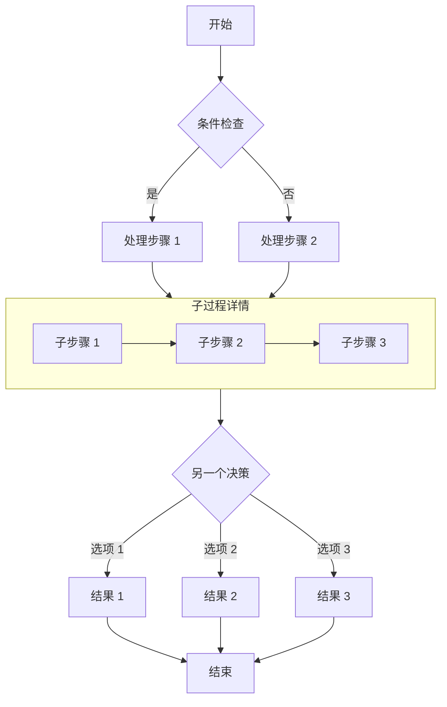
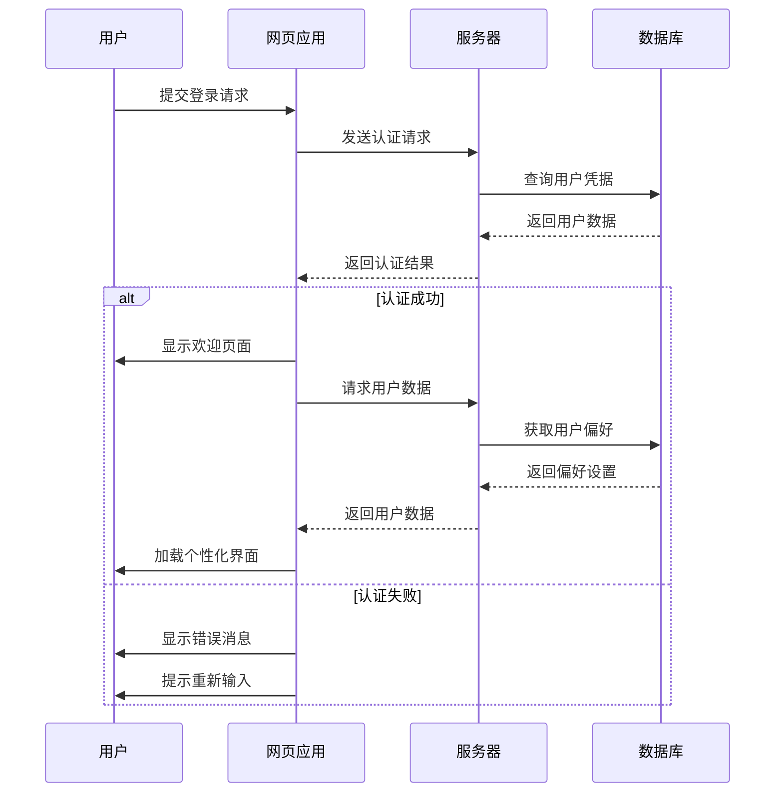
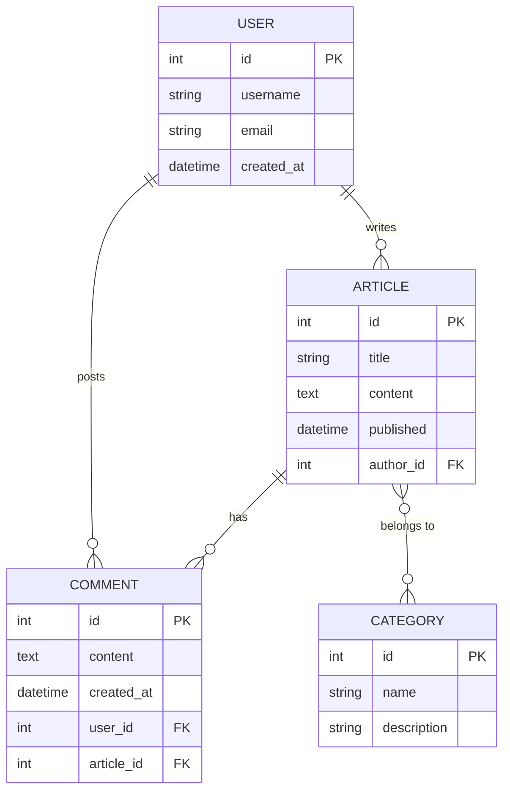
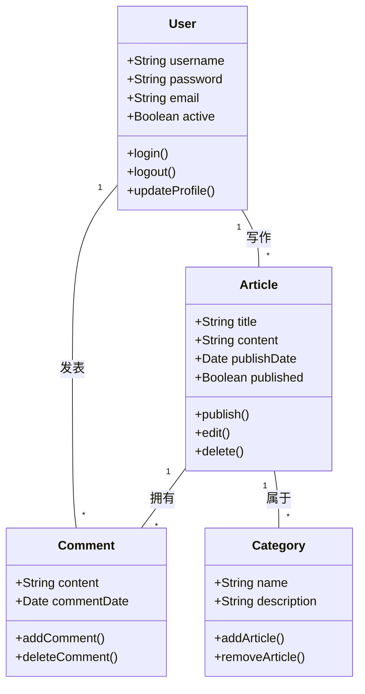
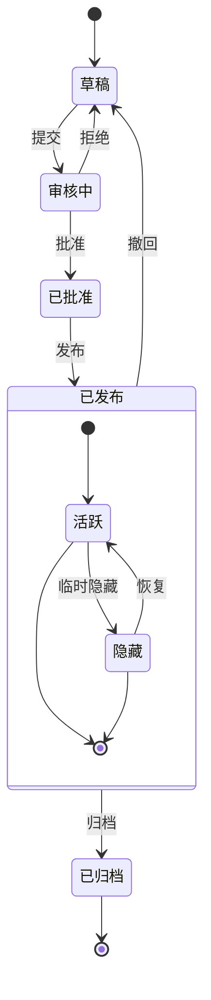

## Markdown 中 Mermaid 图表完整指南

本文演示如何在 Markdown 文档中使用 Mermaid 创建各种复杂图表，包括流程图、时序图、ER 图、类图、状态图和 XY 图。

## 流程图示例

流程图非常适合表示流程或算法步骤。




## 时序图示例

时序图显示对象之间随时间的交互。



## ER 图示例

ER 图（实体关系图）非常适合表示数据库结构。



## 类图示例

类图显示系统的静态结构，包括类、属性、方法及其关系。



## 状态图示例

状态图显示对象在其生命周期中经历的状态序列。



## XY 图示例

XY 图表非常适合展示趋势和对比数据。

```mermaid
xychart-beta
    title "月度访问量趋势"
    x-axis [1月, 2月, 3月, 4月, 5月, 6月]
    y-axis "访问量" 0 --> 5000
    bar [2500, 3200, 4100, 3800, 4500, 4800]
    line [2500, 3200, 4100, 3800, 4500, 4800]
```

## 总结

Mermaid 是在 Markdown 文档中创建各种类型图表的强大工具。本文演示了如何使用流程图、时序图、ER 图、类图、状态图和 XY 图。这些图表可以帮助您更清晰地表达复杂的概念、流程和数据结构。

要使用 Mermaid，只需在代码块中指定 mermaid 语言，并使用简洁的文本语法描述图表。图表会在构建时自动渲染为 SVG，无需客户端 JavaScript 加载。

尝试在您的下一篇技术博客文章或项目文档中使用 Mermaid 图表 - 它们将使您的内容更加专业且更易理解！